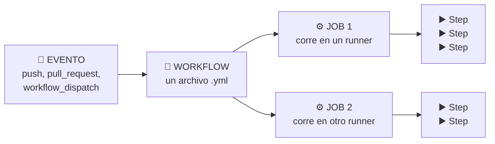
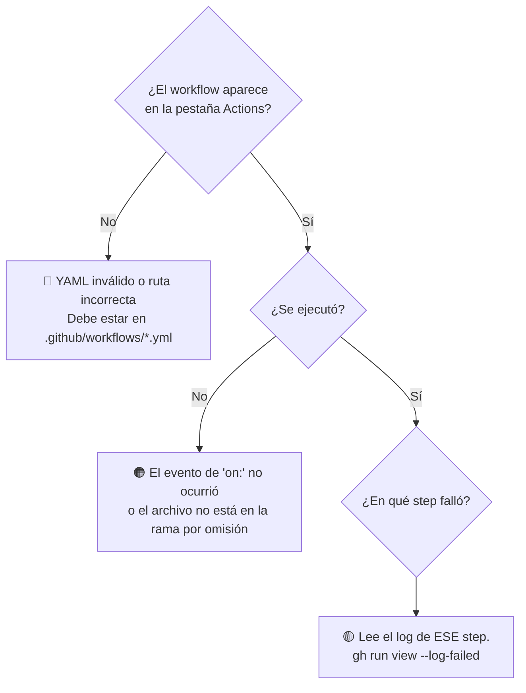

<div align="center">

# 🚴‍♂️ Taller de GitHub Actions

### Automatiza, protege y publica tu código — de cero a un pipeline completo


**Todo el taller vive en este único archivo. No tienes que abrir nada más.**

</div>

---

## 📑 Tabla de contenidos

| | Sección | Tiempo |
|---|---------|--------|
| 🎯 | [Introducción](#-introducción) | 5 min |
| 🧠 | [Conceptos clave de GitHub Actions](#-conceptos-clave-de-github-actions) | 10 min |
| 🛠️ | [Pre-requisitos](#️-pre-requisitos) | — |
| 📅 | [Agenda del taller](#-agenda-del-taller) | — |
| 🚲 | [El proyecto base](#-el-proyecto-base) | — |
| 0️⃣ | [Módulo 0 · Preparación](#0️⃣-módulo-0--preparación) | 10 min |
| 1️⃣ | [Módulo 1 · Tu primer workflow](#1️⃣-módulo-1--tu-primer-workflow) | 15 min |
| 2️⃣ | [Módulo 2 · Integración continua](#2️⃣-módulo-2--integración-continua) | 20 min |
| 3️⃣ | [Módulo 3 · Artefactos y resumen](#3️⃣-módulo-3--artefactos-y-resumen) | 15 min |
| 4️⃣ | [Módulo 4 · Jobs encadenados y diagnóstico](#4️⃣-módulo-4--jobs-encadenados-y-diagnóstico) | 20 min |
| 5️⃣ | [Módulo 5 · Proteger la rama main](#5️⃣-módulo-5--proteger-la-rama-main) | 20 min |
| 6️⃣ | [Módulo 6 · Tags y releases](#6️⃣-módulo-6--tags-y-releases) | 15 min |
| 7️⃣ | [Módulo 7 · Temas avanzados](#7️⃣-módulo-7--temas-avanzados) | Opcional |
| 📖 | [Referencia rápida de sintaxis](#-referencia-rápida-de-sintaxis) | — |
| 🆘 | [Solución de problemas](#-solución-de-problemas) | — |
| ✅ | [Checklist final](#-checklist-final) | — |
| 🙋 | [Preguntas frecuentes](#-preguntas-frecuentes) | — |
| 🎓 | [Si vas a impartir el taller](#-si-vas-a-impartir-el-taller) | — |
| 📚 | [Recursos adicionales](#-recursos-adicionales) | — |

---

## 🎯 Introducción

Este taller práctico de **2 horas** está hecho para quien ya usa Git y GitHub
todos los días —ramas, commits, pull requests— pero **nunca ha escrito un
workflow de GitHub Actions**.

No vas a leer teoría sobre CI/CD. Vas a **construir un pipeline real**, paso por
paso, y cada módulo termina con una verificación concreta para que sepas si
funcionó.

### 🏁 Al terminar vas a tener

| | Resultado |
|---|-----------|
| ⚙️ | Un pipeline que **compila y prueba** en cada push y en cada pull request |
| 📦 | **Reportes descargables** y un resumen legible de cada ejecución |
| 🛡️ | La rama `main` **protegida**: no se puede hacer merge con el pipeline en rojo |
| 🏷️ | Un **tag** con versionamiento semántico y un **release publicado** solo |
| 🔍 | La capacidad de **leer un workflow roto y arreglarlo** |

### 🚫 Qué NO es este taller

> [!IMPORTANT]
> No es un curso de YAML ni un recorrido por el catálogo de funciones de GitHub.
> Los temas avanzados (matriz, caché, workflows reutilizables, GitHub Packages)
> están en el [Módulo 7](#7️⃣-módulo-7--temas-avanzados), **fuera** de las dos
> horas. Meterlos en la sesión principal produce gente que copia YAML sin
> entenderlo.

---

## 🧠 Conceptos clave de GitHub Actions

Antes de escribir nada, cinco palabras. Todo lo demás del taller se construye
sobre estas cinco.



| 🔑 Concepto | Qué es | Dónde vive |
|-------------|--------|------------|
| **Evento** | Lo que dispara la automatización: un push, un PR, un tag, un botón, un horario | La sección `on:` |
| **Workflow** | Un archivo YAML con la receta completa | `.github/workflows/*.yml` |
| **Job** | Un grupo de pasos que corren juntos **en una máquina limpia**. Por omisión los jobs corren **en paralelo** | La sección `jobs:` |
| **Runner** | La máquina virtual donde corre un job. Nace vacía y **se destruye al terminar** | `runs-on:` |
| **Step** | Una instrucción: o ejecuta un comando (`run:`) o invoca una acción de otro (`uses:`) | La sección `steps:` |

### 🧩 Las tres ideas que la gente tarda en entender

> [!WARNING]
> **1 · El runner nace vacío.** No tiene tu código. Por eso casi todo workflow
> empieza con `actions/checkout`. Si lo olvidas, el error no dice "falta
> checkout", dice "no encontré el proyecto".

> [!WARNING]
> **2 · Los jobs NO comparten disco.** Cada job es una máquina distinta. Lo que
> el job A escribió en disco, el job B no lo ve. Para pasar archivos entre jobs
> se usan **artefactos**; para pasar textos cortos, **outputs**.

> [!WARNING]
> **3 · Todo se destruye al final.** El runner desaparece y se lleva tus
> reportes. Si quieres conservar algo, tienes que **subirlo** antes de que
> termine el job.

---

## 🛠️ Pre-requisitos

### 📚 Conocimiento previo

| Necesitas saber | No necesitas saber |
|-----------------|--------------------|
| ✅ Clonar, crear ramas, hacer commits y push | ❌ C# (el código es aritmética y texto) |
| ✅ Abrir y mergear un pull request | ❌ YAML (lo vas aprendiendo) |
| ✅ Usar la terminal para comandos básicos | ❌ Docker, Kubernetes o nubes |

### 💻 Herramientas

Tienes dos caminos. **Elige uno**:

| | 🅰️ GitHub Codespaces | 🅱️ Tu máquina |
|---|---|---|
| Instalación | Nada | SDK .NET 10, Git 2.30+, GitHub CLI 2.40+ |
| Tiempo de arranque | ~2 min | ~15 min si empiezas de cero |
| Recomendado para | Talleres en vivo | Quien ya tiene todo instalado |

### 🔴 Un requisito que no es negociable

> [!CAUTION]
> **Tu repositorio debe ser público.** Dos razones reales de la plataforma:
>
> 1. **Los rulesets y la protección de ramas** solo están disponibles en
>    repositorios públicos con el plan **GitHub Free**. El
>    [Módulo 5](#5️⃣-módulo-5--proteger-la-rama-main) depende por completo de ellos.
> 2. **Los minutos de Actions son ilimitados** en repositorios públicos. En
>    privados consumes la cuota mensual de tu cuenta.
>
> Si tienes GitHub Team o Enterprise, puedes trabajar en privado sin problema.

---

## 📅 Agenda del taller

| # | Módulo | ⏱️ | Qué construyes |
|---|--------|----|----------------|
| 0️⃣ | [Preparación](#0️⃣-módulo-0--preparación) | 10 min | Tu copia del repo, compilando |
| 1️⃣ | [Tu primer workflow](#1️⃣-módulo-1--tu-primer-workflow) | 15 min | Un workflow manual. Cuatro conceptos, nada más |
| 2️⃣ | [Integración continua](#2️⃣-módulo-2--integración-continua) | 20 min | Compilar y probar en cada push. Y **verlo fallar** |
| 3️⃣ | [Artefactos y resumen](#3️⃣-módulo-3--artefactos-y-resumen) | 15 min | Sacar reportes del runner antes de que se destruya |
| 4️⃣ | [Jobs y diagnóstico](#4️⃣-módulo-4--jobs-encadenados-y-diagnóstico) | 20 min | `needs`, `outputs` y 4 errores en un YAML roto |
| 5️⃣ | [Proteger main](#5️⃣-módulo-5--proteger-la-rama-main) | 20 min | Ruleset, CODEOWNERS, un PR bloqueado por CI |
| 6️⃣ | [Tags y releases](#6️⃣-módulo-6--tags-y-releases) | 15 min | SemVer y publicación automática |
| 7️⃣ | [Temas avanzados](#7️⃣-módulo-7--temas-avanzados) | Opcional | Matriz, caché, packages, reutilizables |

**Total de la sesión principal: 1 h 55 min.**

---

## 🚲 El proyecto base

`ContosoBiker.Tarifas` es una librería pequeña de .NET que calcula lo que cuesta
rentar una bicicleta. Existe por una sola razón: **para que tu pipeline tenga
algo real que compilar y probar**.

Suficientemente concreto para que los tiempos y los reportes signifiquen algo.
Suficientemente simple para no distraerte del tema del taller.

```text
📁 .
├── 📄 README.md                     ← estás aquí: TODO el taller
├── 📄 TallerWorkflows.sln
├── 📁 .devcontainer/                Configuración de Codespaces
├── 📁 .github/
│   ├── 📁 workflows/
│   │   ├── 00-hola-workflows.yml         Módulo 1 · manual
│   │   └── 01-integracion-continua.yml   Módulo 2+ · lo vas modificando
│   ├── CODEOWNERS                        Módulo 5
│   ├── dependabot.yml
│   ├── pull_request_template.md
│   └── 📁 ISSUE_TEMPLATE/
├── 📁 scripts/
│   ├── verificar-entorno.sh
│   └── verificar-entorno.ps1
├── 📁 src/ContosoBiker.Tarifas/
│   ├── CalculadoraTarifas.cs        Subtotal, descuento semanal, recargo
│   └── FormateadorMoneda.cs         Formato de moneda y ticket
└── 📁 tests/ContosoBiker.Tarifas.Tests/
    ├── CalculadoraTarifasTests.cs
    └── FormateadorMonedaTests.cs    20 pruebas en total
```

### 📐 Las reglas de negocio (para que las pruebas tengan sentido)

| Regla | Detalle |
|-------|---------|
| 💰 Subtotal | `tarifa diaria × días` |
| 🎁 Descuento semanal | **15 %** cuando la renta dura **7 días o más** |
| ⏰ Recargo por retraso | **10 %** de la tarifa diaria por **cada hora** iniciada |
| 🇲🇽 Formato | Moneda mexicana, dos decimales: `$1,234.50` |

---
## 0️⃣ Módulo 0 · Preparación

> ⏱️ **10 minutos** · 🎚️ Sin dificultad

### 🎯 Qué vas a lograr

Una copia propia de este repositorio, en tu cuenta, con el proyecto compilando y
las 20 pruebas pasando. Si eso funciona, todo lo demás del taller funciona.

### 🔧 Paso 1 · Crea tu copia del repositorio

<details open>
<summary><b>🅰️ Con GitHub Codespaces (recomendado)</b></summary>

1. En la página del repositorio, pulsa **Use this template** → **Create a new repository**.
   - Nombre sugerido: `mi-taller-workflows`
   - Visibilidad: **Public** ⚠️
2. Ya en **tu** repositorio, pulsa el botón verde **Code**.
3. Pestaña **Codespaces** → **Create codespace on main**.
4. Espera 1-2 minutos a que abra Visual Studio Code en el navegador.

</details>

<details>
<summary><b>🅱️ En tu máquina</b></summary>

```bash
# 1. Inicia sesión en GitHub desde la terminal
gh auth login

# 2. Crea tu copia del repositorio (reemplaza PROPIETARIO)
gh repo create mi-taller-workflows --public --clone \
  --template PROPIETARIO/github-workflows-workshop-fundamentos

cd mi-taller-workflows
```

Si el repositorio no está marcado como *template*, usa un fork:

```bash
gh repo fork PROPIETARIO/github-workflows-workshop-fundamentos --clone
```

</details>

### 🔧 Paso 2 · Comprueba que todo funciona

```bash
dotnet test TallerWorkflows.sln
```

Salida esperada:

```text
Passed!  - Failed: 0, Passed: 20, Skipped: 0, Total: 20
```

O usa el script que hace todas las comprobaciones de una vez:

```bash
bash scripts/verificar-entorno.sh      # Linux, macOS, Codespaces
```

```powershell
pwsh scripts/verificar-entorno.ps1     # Windows
```

```text
  [OK]    Git instalado
  [OK]    SDK de .NET instalado
  [OK]    GitHub CLI instalado
  [OK]    Sesion de GitHub CLI
  [OK]    Restaurar dependencias
  [OK]    Compilar la solucion
  [OK]    Ejecutar las pruebas
```

### 🔧 Paso 3 · Habilita Actions en tu repositorio

En **tu** repositorio: **Settings → Actions → General → Allow all actions and
reusable workflows** → **Save**.

> [!NOTE]
> En repositorios creados desde un template, Actions suele venir habilitado. En
> forks a veces viene deshabilitado y hay que pulsar un botón verde en la
> pestaña **Actions** que dice *"I understand my workflows, go ahead and enable them"*.

### ✅ Cómo sabes que terminaste

- [ ] El repositorio existe en **tu** cuenta y es **público**
- [ ] `dotnet test` termina con **20 pruebas en verde**
- [ ] La pestaña **Actions** de tu repositorio se abre y muestra workflows

---

## 1️⃣ Módulo 1 · Tu primer workflow

> ⏱️ **15 minutos** · 🎚️ Fácil

### 🎯 Qué vas a lograr

Ejecutar un workflow a mano desde el navegador y entender **exactamente** qué
hace cada línea de su YAML. Cuatro conceptos, ni uno más.

### 💡 Conceptos de este módulo

| Concepto | Para qué |
|----------|----------|
| `on: workflow_dispatch` | Un workflow que **tú** disparas con un botón |
| `inputs` | Pedirle datos a quien lo ejecuta |
| `runs-on` | Elegir el sistema operativo de la máquina |
| Contexto `github` | Variables que GitHub te regala: quién, dónde, por qué |

### 🔧 Paso 1 · Lee la anatomía

Abre [`.github/workflows/00-hola-workflows.yml`](.github/workflows/00-hola-workflows.yml).
Te lo explico línea por línea:

```yaml
name: 00 · Hola workflows          # 1️⃣ El nombre que verás en la pestaña Actions

on:                                 # 2️⃣ CUÁNDO se ejecuta
  workflow_dispatch:                #    Solo cuando tú pulsas el botón
    inputs:                         #    Y además te pide un dato
      nombre:
        description: "¿Cómo te llamas?"
        required: true
        default: "ciclista"

jobs:                               # 3️⃣ QUÉ hace, agrupado en jobs
  saludar:                          #    "saludar" es el ID del job
    name: Saludar y mostrar el contexto
    runs-on: ubuntu-latest          # 4️⃣ DÓNDE corre: una VM Ubuntu limpia

    steps:                          # 5️⃣ Los pasos, en orden, uno tras otro
      - name: Saludar a la persona
        run: echo "¡Hola, ${{ inputs.nombre }}!"
```

| 🔢 | Qué aprendiste |
|----|----------------|
| 1️⃣ | `name` es cosmético, pero es lo único que verás en la lista de ejecuciones |
| 2️⃣ | `on` define el **disparador**. Sin él, el workflow nunca corre |
| 3️⃣ | Un workflow puede tener **varios jobs**. Por omisión corren **en paralelo** |
| 4️⃣ | `runs-on` acepta `ubuntu-latest`, `windows-latest` o `macos-latest` |
| 5️⃣ | Los steps de un job corren **en serie**. Si uno falla, los siguientes se saltan |

> [!TIP]
> `${{ ... }}` es la sintaxis de **expresiones**. Todo lo que va dentro lo evalúa
> GitHub **antes** de ejecutar el comando.

### 🔧 Paso 2 · Ejecútalo

1. Ve a la pestaña **Actions** de tu repositorio.
2. En la barra lateral izquierda, elige **00 · Hola workflows**.
3. A la derecha aparece el botón **Run workflow** ▶️.
4. Escribe tu nombre en el campo y pulsa **Run workflow**.
5. Recarga la página. Aparece una ejecución con un círculo amarillo 🟡.
6. Pulsa en ella → pulsa el job **Saludar y mostrar el contexto**.
7. Despliega cada step para ver su salida.

> [!NOTE]
> El botón **Run workflow** solo aparece si el archivo con `workflow_dispatch`
> **ya está en la rama por omisión** (`main`). Es la causa número uno de
> "no me aparece el botón".

### 🔧 Paso 3 · Lo mismo desde la terminal

```bash
# Dispararlo
gh workflow run "00 · Hola workflows" -f nombre="Ana"

# Ver las últimas ejecuciones
gh run list --limit 5

# Ver el detalle y los logs de la más reciente
gh run view --log
```

### 🔧 Paso 4 · Rómpelo a propósito 💥

Aprender a leer un error es más útil que evitarlo. Edita el archivo y cambia:

```diff
-    runs-on: ubuntu-latest
+    runs-on: ubuntu-ultimo
```

Haz commit, push, y vuelve a ejecutarlo. Verás:

```text
❌ This request was automatically failed because there were no enabled
   runners online to process the request for over 1 days.
```

**Lección:** GitHub no valida que la etiqueta del runner exista. Se queda
esperando una máquina que nunca va a llegar. Si tu job se queda en cola para
siempre, sospecha de `runs-on` primero.

Ahora **deshaz el cambio** y sigue.

### ✅ Cómo sabes que terminaste

- [ ] Tienes al menos una ejecución con ✅ verde
- [ ] Viste tu nombre impreso en el log del primer step
- [ ] Entiendes qué es un evento, un job, un runner y un step
- [ ] Reprodujiste el error de `runs-on` y lo corregiste

### 🆘 Si algo falla

| Síntoma | Causa | Solución |
|---------|-------|----------|
| No aparece **Run workflow** | El archivo no está en `main` | Haz merge a `main` y recarga |
| No aparece el workflow en la lista | YAML inválido o ruta incorrecta | Debe estar en `.github/workflows/` y terminar en `.yml` |
| El job se queda en cola 🟡 para siempre | `runs-on` con una etiqueta que no existe | Usa `ubuntu-latest` |

---
## 2️⃣ Módulo 2 · Integración continua

> ⏱️ **20 minutos** · 🎚️ Media

### 🎯 Qué vas a lograr

Un pipeline que **compila y ejecuta las pruebas automáticamente** en cada push y
en cada pull request. Y, más importante: vas a **verlo fallar** a propósito para
entender de qué te protege.

### 💡 Conceptos de este módulo

| Concepto | Para qué |
|----------|----------|
| `on: push` / `on: pull_request` | Disparadores automáticos, sin botones |
| `actions/checkout` | Traer tu código al runner, que nace vacío |
| `actions/setup-dotnet` | Instalar el SDK en el runner |
| `env` | Variables compartidas por todo el workflow |
| `uses` vs `run` | Invocar una acción de otro vs ejecutar un comando tuyo |

### 🔧 Paso 1 · Lee el pipeline

Abre [`.github/workflows/01-integracion-continua.yml`](.github/workflows/01-integracion-continua.yml):

```yaml
name: 01 · Integración continua

on:
  push:
    branches: ["main"]          # 🔔 cada push a main
  pull_request:
    branches: ["main"]          # 🔔 cada PR que apunte a main
  workflow_dispatch:            # 🔔 y también a mano, por si acaso

env:
  VERSION_DOTNET: "10.0.x"      # 📌 una sola fuente de verdad para la versión

jobs:
  construir-y-probar:
    name: Construir y probar
    runs-on: ubuntu-latest

    steps:
      - name: Descargar el código
        uses: actions/checkout@v7        # ⬅️ SIN esto el runner está vacío

      - name: Instalar el SDK de .NET
        uses: actions/setup-dotnet@v6
        with:
          dotnet-version: ${{ env.VERSION_DOTNET }}

      - name: Restaurar dependencias
        run: dotnet restore TallerWorkflows.sln

      - name: Compilar
        run: dotnet build TallerWorkflows.sln --configuration Release --no-restore

      - name: Ejecutar pruebas
        run: dotnet test TallerWorkflows.sln --configuration Release --no-build
```

#### 🤔 Por qué `--no-restore` y `--no-build`

Porque el paso anterior ya lo hizo. Sin esas banderas, `dotnet test` restauraría
y compilaría **otra vez**, y tu pipeline tardaría el doble. Además, si un paso
falla, quieres saber **cuál**: el de compilar o el de probar.

#### 🤔 Por qué `@v7` y no `@main`

Porque `@main` es un blanco móvil: el autor de la acción puede cambiarla mañana
y tu pipeline se rompe sin que tú hayas tocado nada. **Siempre fija una versión.**

> [!TIP]
> El archivo [`.github/dependabot.yml`](.github/dependabot.yml) de este repositorio
> hace que Dependabot te abra un PR cuando salga `@v8`. Así fijas versiones sin
> quedarte atrás.

### 🔧 Paso 2 · Dispáralo con un cambio real

Vamos a agregar una regla de negocio: **tarifa de fin de semana, 20 % más cara**.

Crea una rama:

```bash
git switch -c feature/tarifa-fin-de-semana
```

Agrega este método a `src/ContosoBiker.Tarifas/CalculadoraTarifas.cs`, **antes**
del último `}` del archivo:

```csharp
    /// <summary>
    /// Aplica el recargo de fin de semana: 20 % sobre la tarifa base.
    /// </summary>
    public static decimal AplicarTarifaFinDeSemana(decimal tarifaDiaria)
    {
        if (tarifaDiaria < 0)
        {
            throw new ArgumentOutOfRangeException(nameof(tarifaDiaria), "La tarifa diaria no puede ser negativa.");
        }

        return Math.Round(tarifaDiaria * 1.20m, 2, MidpointRounding.AwayFromZero);
    }
```

Y esta prueba a `tests/ContosoBiker.Tarifas.Tests/CalculadoraTarifasTests.cs`,
antes del último `}`:

```csharp
    [Fact]
    public void AplicarTarifaFinDeSemana_AgregaVeintePorCiento()
    {
        Assert.Equal(144m, CalculadoraTarifas.AplicarTarifaFinDeSemana(120m));
    }
```

Comprueba en local y sube:

```bash
dotnet test TallerWorkflows.sln
git add .
git commit -m "feat: tarifa de fin de semana con 20 % de recargo"
git push -u origin feature/tarifa-fin-de-semana
```

### 🔧 Paso 3 · Abre el pull request y míralo correr

```bash
gh pr create --fill --base main
```

Abre el PR en el navegador. Al final de la conversación aparece una caja de
verificaciones:

```text
🟡 01 · Integración continua / Construir y probar — In progress
```

Y en un minuto:

```text
✅ All checks have passed
```

> [!NOTE]
> El evento `pull_request` **no** ejecuta el código de tu rama tal cual: ejecuta
> una **fusión temporal** de tu rama con `main`. Por eso el PR te avisa de
> conflictos de integración que un `push` solo no detectaría.

### 🔧 Paso 4 · Ahora rómpelo 💥

Este es el paso más valioso del módulo. En tu misma rama, cambia el recargo de
`1.20m` a `1.50m` **sin cambiar la prueba**:

```diff
-        return Math.Round(tarifaDiaria * 1.20m, 2, MidpointRounding.AwayFromZero);
+        return Math.Round(tarifaDiaria * 1.50m, 2, MidpointRounding.AwayFromZero);
```

```bash
git commit -am "fix: subir el recargo de fin de semana"
git push
```

Vuelve al PR. Ahora:

```text
❌ Some checks were not successful
```

Pulsa **Details** y busca en el log:

```text
  Failed AplicarTarifaFinDeSemana_AgregaVeintePorCiento [< 1 ms]
  Error Message:
   Assert.Equal() Failure: Values differ
   Expected: 144
   Actual:   180.00
```

**Esto es todo el valor de la integración continua**: el error te llegó en 60
segundos, en el PR, antes de que nadie hiciera merge. Sin el pipeline, ese `1.50m`
habría llegado a producción.

Revierte a `1.20m`, haz push, y confirma que vuelve a verde ✅.

### 🔧 Paso 5 · Haz merge

```bash
gh pr merge --squash --delete-branch
```

### ✅ Cómo sabes que terminaste

- [ ] El pipeline corre solo, sin que pulses ningún botón
- [ ] Viste la caja de verificaciones dentro del PR
- [ ] **Viste el pipeline en rojo** y leíste el mensaje de la prueba fallida
- [ ] Lo arreglaste y volvió a verde
- [ ] Hiciste merge y el pipeline corrió otra vez sobre `main`

### 🆘 Si algo falla

| Síntoma | Causa | Solución |
|---------|-------|----------|
| `MSB1003: Specify a project` | Falta `actions/checkout` | El runner está vacío. Agrega el checkout |
| `NETSDK1045: no soporta net10.0` | `setup-dotnet` instaló otra versión | Revisa `VERSION_DOTNET: "10.0.x"` |
| El workflow no se dispara con el PR | El PR apunta a otra rama | `branches: ["main"]` filtra la rama **destino** |
| `error NU1101: no se encontró el paquete` | Red del runner o versión inexistente | Revisa las versiones en el `.csproj` |

---
## 3️⃣ Módulo 3 · Artefactos y resumen

> ⏱️ **15 minutos** · 🎚️ Media

### 🎯 Qué vas a lograr

Sacar del runner un reporte de pruebas descargable, y escribir un resumen
legible que aparezca en la portada de cada ejecución.

### 💡 Conceptos de este módulo

| Concepto | Para qué |
|----------|----------|
| **Artefacto** | Un archivo o carpeta que sobrevive a la destrucción del runner |
| `actions/upload-artifact` | Subirlo antes de que el runner muera |
| `if: always()` | Ejecutar un step **aunque** los anteriores hayan fallado |
| `$GITHUB_STEP_SUMMARY` | Un archivo Markdown que GitHub muestra en la portada de la ejecución |

> [!IMPORTANT]
> **El runner se destruye al terminar el job.** El reporte `.trx` que genera
> `dotnet test` existe solo dentro de esa máquina. Si no lo subes como
> artefacto, desaparece y nunca lo vas a ver.

### 🔧 Paso 1 · Genera el reporte

En [`.github/workflows/01-integracion-continua.yml`](.github/workflows/01-integracion-continua.yml),
**reemplaza** el step de pruebas por este:

```yaml
      - name: Ejecutar pruebas y generar reporte
        run: |
          dotnet test TallerWorkflows.sln \
            --configuration Release \
            --no-build \
            --logger "trx;LogFileName=resultados.trx" \
            --results-directory reportes
```

| Bandera | Qué hace |
|---------|----------|
| `--logger "trx;..."` | Genera un reporte XML con el detalle de cada prueba |
| `--results-directory reportes` | Lo deja en una carpeta predecible |

> [!TIP]
> El `|` después de `run:` significa "lo que sigue es un bloque de texto de
> varias líneas". Es lo que te permite escribir comandos largos partidos con `\`.

### 🔧 Paso 2 · Súbelo como artefacto

Agrega este step **después** del anterior:

```yaml
      - name: Guardar el reporte de pruebas
        if: always()
        uses: actions/upload-artifact@v7
        with:
          name: reporte-de-pruebas
          path: reportes/
          retention-days: 7
```

#### 🔑 Por qué `if: always()` es la línea más importante de este módulo

Por omisión, **si un step falla, los siguientes se saltan**. Pero el reporte de
pruebas lo quieres justamente **cuando las pruebas fallan**. Sin `if: always()`,
el artefacto solo se sube cuando todo salió bien — o sea, cuando no lo necesitas.

| Condición | Cuándo corre el step |
|-----------|----------------------|
| *(sin condición)* | Solo si todo lo anterior salió bien |
| `if: always()` | Siempre, incluso si algo falló o se canceló |
| `if: failure()` | Solo si algo falló |
| `if: success()` | Igual que sin condición (explícito) |

### 🔧 Paso 3 · Escribe el resumen

Agrega este último step:

```yaml
      - name: Escribir el resumen de la ejecución
        if: always()
        run: |
          {
            echo "## 🚲 Resultado de la integración continua"
            echo ""
            echo "| Dato | Valor |"
            echo "| --- | --- |"
            echo "| Rama | \`${{ github.ref_name }}\` |"
            echo "| Commit | \`${{ github.sha }}\` |"
            echo "| Evento | \`${{ github.event_name }}\` |"
            echo "| Resultado | ${{ job.status == 'success' && '✅ verde' || '❌ rojo' }} |"
            echo ""
            echo "El reporte \`.trx\` está en la sección **Artifacts**."
          } >> "$GITHUB_STEP_SUMMARY"
```

`$GITHUB_STEP_SUMMARY` es una variable de entorno que apunta a un archivo. Todo
lo que escribas ahí en formato Markdown, GitHub lo renderiza en la portada de la
ejecución. Es la diferencia entre *"alguien tiene que leer 400 líneas de log"* y
*"se ve de un vistazo"*.

<details>
<summary>📄 <b>Ver el workflow completo al terminar este módulo</b></summary>

```yaml
name: 01 · Integración continua

on:
  push:
    branches: ["main"]
  pull_request:
    branches: ["main"]
  workflow_dispatch:

env:
  VERSION_DOTNET: "10.0.x"

jobs:
  construir-y-probar:
    name: Construir y probar
    runs-on: ubuntu-latest

    steps:
      - name: Descargar el código
        uses: actions/checkout@v7

      - name: Instalar el SDK de .NET
        uses: actions/setup-dotnet@v6
        with:
          dotnet-version: ${{ env.VERSION_DOTNET }}

      - name: Restaurar dependencias
        run: dotnet restore TallerWorkflows.sln

      - name: Compilar
        run: dotnet build TallerWorkflows.sln --configuration Release --no-restore

      - name: Ejecutar pruebas y generar reporte
        run: |
          dotnet test TallerWorkflows.sln \
            --configuration Release \
            --no-build \
            --logger "trx;LogFileName=resultados.trx" \
            --results-directory reportes

      - name: Guardar el reporte de pruebas
        if: always()
        uses: actions/upload-artifact@v7
        with:
          name: reporte-de-pruebas
          path: reportes/
          retention-days: 7

      - name: Escribir el resumen de la ejecución
        if: always()
        run: |
          {
            echo "## 🚲 Resultado de la integración continua"
            echo ""
            echo "| Dato | Valor |"
            echo "| --- | --- |"
            echo "| Rama | \`${{ github.ref_name }}\` |"
            echo "| Commit | \`${{ github.sha }}\` |"
            echo "| Evento | \`${{ github.event_name }}\` |"
            echo "| Resultado | ${{ job.status == 'success' && '✅ verde' || '❌ rojo' }} |"
            echo ""
            echo "El reporte \`.trx\` está en la sección **Artifacts**."
          } >> "$GITHUB_STEP_SUMMARY"
```

</details>

### 🔧 Paso 4 · Pruébalo

```bash
git add .github/workflows/01-integracion-continua.yml
git commit -m "ci: guardar el reporte de pruebas y escribir el resumen"
git push
```

En la pestaña **Actions**, abre la ejecución más reciente. Deberías ver:

1. 📊 **Arriba**, tu tabla de resumen renderizada.
2. 📦 **Abajo**, una sección **Artifacts** con `reporte-de-pruebas` y un botón
   de descarga.

### 🔧 Paso 5 · Comprueba que `if: always()` sirve de algo

Rompe una prueba a propósito:

```bash
# Cambia cualquier número esperado en CalculadoraTarifasTests.cs
git commit -am "test: romper una prueba a proposito"
git push
```

La ejecución sale ❌ roja **pero el artefacto se sube igual**, y el resumen dice
`❌ rojo`. Descarga el `.trx` y ábrelo: ahí está el detalle de la prueba fallida.

Ahora quita `if: always()` del step del artefacto, vuelve a romper la prueba, y
verás que el artefacto **ya no aparece**. Esa es la lección. Vuelve a ponerlo y
arregla la prueba.

### ✅ Cómo sabes que terminaste

- [ ] Ves la tabla de resumen en la portada de la ejecución
- [ ] Puedes descargar `reporte-de-pruebas` desde la sección **Artifacts**
- [ ] El artefacto se sube **también** cuando el pipeline está en rojo
- [ ] Entiendes por qué `if: always()` es obligatorio aquí

### 🆘 Si algo falla

| Síntoma | Causa | Solución |
|---------|-------|----------|
| `No files were found with the provided path` | La carpeta `reportes/` no existe | El step de pruebas falló antes de generarla; revisa el log |
| El resumen sale vacío | Escribiste con `>` en vez de `>>` | `>` sobrescribe el archivo; usa `>>` |
| El resumen sale como texto plano | Faltan líneas en blanco entre bloques Markdown | Agrega `echo ""` entre secciones |
| El artefacto no aparece al fallar | Falta `if: always()` | Agrégalo al step de subida |

---
## 4️⃣ Módulo 4 · Jobs encadenados y diagnóstico

> ⏱️ **20 minutos** · 🎚️ Alta · Dos partes

---

### 🅰️ Parte A · Dividir el pipeline en varios jobs (10 min)

#### 🎯 Qué vas a lograr

Separar *compilar* de *probar* en dos jobs distintos, pasarles información entre
ellos, y agregar un tercer job que reporte el resultado de ambos.

#### 💡 Conceptos de esta parte

| Concepto | Para qué |
|----------|----------|
| `needs` | "No empieces hasta que termine ese otro job" |
| `outputs` | Pasar un **texto corto** de un job a otro |
| Artefactos entre jobs | Pasar **archivos** de un job a otro |
| `needs.<job>.result` | Leer si el job anterior salió verde, rojo o cancelado |

> [!IMPORTANT]
> **Cada job corre en una máquina distinta y limpia.** No comparten disco, ni
> variables, ni el código descargado. Por eso el segundo job tiene que hacer su
> propio `checkout` y recuperar los binarios como artefacto.

#### 🤔 ¿Y para qué lo dividiría?

| Razón | Explicación |
|-------|-------------|
| 🔍 **Diagnóstico** | La lista de jobs te dice de un vistazo si falló al compilar o al probar |
| ⚡ **Paralelismo** | Jobs sin `needs` entre sí corren al mismo tiempo |
| 🎯 **Reintentos** | Puedes reintentar solo el job que falló, no todo el pipeline |
| 🛡️ **Permisos** | Cada job puede tener permisos distintos (útil en despliegues) |

> [!WARNING]
> Dividir tiene un costo: cada job arranca una máquina nueva, descarga el código
> y reinstala el SDK. En un proyecto pequeño como este, **dividir es más lento**.
> Se divide cuando el diagnóstico o el paralelismo valen más que esos segundos.

#### 🔧 Reescribe el workflow

Reemplaza **todo** el contenido de
[`.github/workflows/01-integracion-continua.yml`](.github/workflows/01-integracion-continua.yml)
por esto:

```yaml
name: 01 · Integración continua

on:
  push:
    branches: ["main"]
  pull_request:
    branches: ["main"]
  workflow_dispatch:

env:
  VERSION_DOTNET: "10.0.x"

jobs:
  construir:
    name: Construir
    runs-on: ubuntu-latest
    outputs:
      version: ${{ steps.leer-version.outputs.version }}   # 📤 lo que este job exporta

    steps:
      - name: Descargar el código
        uses: actions/checkout@v7

      - name: Instalar el SDK de .NET
        uses: actions/setup-dotnet@v6
        with:
          dotnet-version: ${{ env.VERSION_DOTNET }}

      - name: Restaurar dependencias
        run: dotnet restore TallerWorkflows.sln

      - name: Compilar
        run: dotnet build TallerWorkflows.sln --configuration Release --no-restore

      - name: Leer la versión de la librería
        id: leer-version                                   # 🆔 necesario para referenciarlo
        run: |
          version=$(grep -oPm1 "(?<=<Version>)[^<]+" src/ContosoBiker.Tarifas/ContosoBiker.Tarifas.csproj)
          echo "version=$version" >> "$GITHUB_OUTPUT"
          echo "Versión detectada: $version"

      - name: Guardar el resultado de la compilación
        uses: actions/upload-artifact@v7
        with:
          name: compilacion
          path: |
            src/**/bin/Release/
            src/**/obj/
            tests/**/bin/Release/
            tests/**/obj/
          retention-days: 1

  probar:
    name: Probar
    runs-on: ubuntu-latest
    needs: construir                                       # ⛓️ espera a "construir"

    steps:
      - name: Descargar el código
        uses: actions/checkout@v7

      - name: Instalar el SDK de .NET
        uses: actions/setup-dotnet@v6
        with:
          dotnet-version: ${{ env.VERSION_DOTNET }}

      - name: Recuperar el resultado de la compilación
        uses: actions/download-artifact@v8
        with:
          name: compilacion

      - name: Ejecutar pruebas y generar reporte
        run: |
          dotnet test TallerWorkflows.sln \
            --configuration Release \
            --no-build \
            --logger "trx;LogFileName=resultados.trx" \
            --results-directory reportes

      - name: Guardar el reporte de pruebas
        if: always()
        uses: actions/upload-artifact@v7
        with:
          name: reporte-de-pruebas
          path: reportes/
          retention-days: 7

  resumen:
    name: Resumen
    runs-on: ubuntu-latest
    needs: [construir, probar]                             # ⛓️ espera a los dos
    if: always()                                           # 🔁 corre aunque fallen

    steps:
      - name: Escribir el resumen de la ejecución
        run: |
          {
            echo "## 🚲 Resultado de la integración continua"
            echo ""
            echo "| Etapa | Resultado |"
            echo "| --- | --- |"
            echo "| Construir | ${{ needs.construir.result }} |"
            echo "| Probar | ${{ needs.probar.result }} |"
            echo ""
            echo "Versión de la librería: \`${{ needs.construir.outputs.version }}\`"
          } >> "$GITHUB_STEP_SUMMARY"
```

#### 🔑 Las tres piezas del mecanismo de `outputs`

```yaml
# 1️⃣ El step escribe en el archivo $GITHUB_OUTPUT
  id: leer-version
  run: echo "version=0.1.0" >> "$GITHUB_OUTPUT"

# 2️⃣ El job lo declara como salida suya
  outputs:
    version: ${{ steps.leer-version.outputs.version }}

# 3️⃣ Otro job lo consume, siempre que lo tenga en "needs"
  ${{ needs.construir.outputs.version }}
```

Si te saltas cualquiera de las tres, el valor llega **vacío** y sin error. Es el
fallo silencioso más común con `outputs`.

#### 🔧 Verifícalo

```bash
git add .github/workflows/01-integracion-continua.yml
git commit -m "ci: dividir el pipeline en construir, probar y resumen"
git push
```

En la ejecución deberías ver:

```text
✅ Construir  ──▶  ✅ Probar  ──▶  ✅ Resumen
```

Y en el resumen, la versión `0.1.0` leída por el primer job y mostrada por el tercero.

> [!TIP]
> GitHub dibuja el grafo de dependencias automáticamente. Pulsa el botón
> **"Visualize"** o mira la columna izquierda de la ejecución: las flechas entre
> jobs salen de tus `needs`.

---

### 🅱️ Parte B · El workflow roto (10 min)

#### 🎯 Qué vas a lograr

Encontrar y corregir **cuatro errores** en un workflow. Cada uno representa una
familia distinta de falla, y las cuatro las vas a ver en la vida real.

#### 🧩 El reto

Copia este archivo a `.github/workflows/99-roto.yml` en tu repositorio:

```yaml
name: Workflow con errores

on:
  workflow_dispatch:

jobs:
  construir:
    name: Construir
    runs-on: ubuntu

    steps:
      - name: Instalar el SDK de .NET
        uses: actions/setup-dotnet@v6
        with:
          dotnet-version: "10.0.x"

      - name: Restaurar dependencias
        run: dotnet restore TallerWorkflows.sln

      - name: Compilar
        run: dotnet build TallerWorkflows.sln --configuration Release --no-restore

  probar:
    name: Probar
    runs-on: ubuntu-latest
    needs: compilar

    steps:
      - name: Descargar el código
        uses: actions/checkout@v7

      - name: Instalar el SDK de .NET
        uses: actions/setup-dotnet@v6
        with:
          dotnet-version: "10.0.x"

        - name: Ejecutar pruebas
          run: dotnet test TallerWorkflows.sln --configuration Release
```

**Tu tarea:** encuentra los cuatro errores y corrígelos. Reglas del juego:

1. ⏱️ Tienes 10 minutos.
2. 🔍 Usa el editor: la extensión **GitHub Actions** de VS Code subraya dos de ellos.
3. ▶️ Ejecuta el workflow: GitHub te reporta los otros dos.
4. 🚫 No mires las respuestas hasta intentarlo.

<details>
<summary>💡 <b>Pistas (sin dar la respuesta)</b></summary>

| # | Pista |
|---|-------|
| 1 | Revisa la **etiqueta del runner** del primer job. ¿Existe esa máquina? |
| 2 | El runner nace vacío. ¿Qué le falta al primer job **antes** de compilar? |
| 3 | Lee el `needs` del segundo job en voz alta. ¿Así se llama el job? |
| 4 | Mira la **indentación** del último step. ¿Está alineado con sus hermanos? |

</details>

<details>
<summary>✅ <b>Respuestas y explicación</b></summary>

#### Error 1 · `runs-on: ubuntu` → `runs-on: ubuntu-latest`

**Familia: configuración del runner.**
`ubuntu` no es una etiqueta válida. GitHub no valida esto: pone el job en cola
esperando una máquina que no existe. El síntoma es un job 🟡 eternamente
*"Queued"*, y al final:

```text
This request was automatically failed because there were no enabled
runners online to process the request.
```

**Cómo detectarlo:** si un job nunca arranca, sospecha de `runs-on` primero.

#### Error 2 · Falta `actions/checkout` en el job `construir`

**Familia: el runner nace vacío.**
Sin checkout, `dotnet restore` se ejecuta en un directorio sin código:

```text
MSBUILD : error MSB1003: Specify a project or solution file.
```

El mensaje **no dice** "falta el checkout". Dice que no encuentra el proyecto.
Por eso hay que conocer la causa.

**La corrección:** agrega como primer step del job:

```yaml
      - name: Descargar el código
        uses: actions/checkout@v7
```

#### Error 3 · `needs: compilar` → `needs: construir`

**Familia: dependencias entre jobs.**
El job se llama `construir`, no `compilar`. GitHub valida esto **antes** de
ejecutar nada y rechaza el workflow completo:

```text
Invalid workflow file
The workflow is not valid. Job 'probar' depends on unknown job 'compilar'.
```

**Cómo detectarlo:** este error aparece en rojo en la pestaña Actions sin que se
ejecute ningún job. Si ves *"Invalid workflow file"*, el problema es estructural.

#### Error 4 · El último step está indentado de más

```yaml
      - name: Instalar el SDK de .NET
        uses: actions/setup-dotnet@v6
        with:
          dotnet-version: "10.0.x"

        - name: Ejecutar pruebas      # ⬅️ 8 espacios: es hijo del step anterior
          run: dotnet test ...
```

**Familia: sintaxis YAML.**
Los steps de un job son hermanos y van todos con la misma indentación (6
espacios en este archivo). Con 8, YAML intenta leerlo como parte del step
anterior y el archivo deja de ser válido.

**La corrección:** alinea el step con los demás:

```yaml
      - name: Ejecutar pruebas
        run: dotnet test TallerWorkflows.sln --configuration Release
```

**Cómo detectarlo:** si el workflow **no aparece** en la lista de Actions, casi
siempre es YAML inválido. En VS Code con la extensión de GitHub Actions se ve
subrayado en rojo al instante.

</details>

#### 🎓 Por qué estos cuatro y no otros

| # | Familia | Te enseña |
|---|---------|-----------|
| 1 | Configuración del runner | GitHub no valida etiquetas: falla en silencio |
| 2 | El runner nace vacío | El mensaje de error casi nunca nombra la causa real |
| 3 | Dependencias entre jobs | Hay errores que GitHub sí valida antes de ejecutar |
| 4 | Sintaxis YAML | Un workflow que no aparece es un workflow inválido |

#### 🧹 Limpieza

Cuando termines, borra el archivo de prueba:

```bash
git rm .github/workflows/99-roto.yml
git commit -m "chore: quitar el workflow del ejercicio de diagnostico"
git push
```

### ✅ Cómo sabes que terminaste

- [ ] Tu pipeline tiene tres jobs: **Construir → Probar → Resumen**
- [ ] El resumen muestra la versión que leyó el primer job
- [ ] El job `Probar` usa los binarios que produjo `Construir`
- [ ] Encontraste los cuatro errores y sabes a qué familia pertenece cada uno

---
## 5️⃣ Módulo 5 · Proteger la rama main

> ⏱️ **20 minutos** · 🎚️ Media

### 🎯 Qué vas a lograr

Que `main` deje de aceptar cambios directos, y que **ningún PR pueda hacer merge
con el pipeline en rojo**. Hasta ahora tu pipeline te *avisaba*. Ahora te va a
*detener*.

### 💡 Conceptos de este módulo

| Concepto | Qué es |
|----------|--------|
| **Ruleset** | El mecanismo actual de GitHub para poner reglas sobre ramas y tags |
| **Status check requerido** | Un job que **debe** estar en verde para permitir el merge |
| **CODEOWNERS** | Un archivo que asigna revisores automáticos por ruta |
| **Estrategia de merge** | Merge commit, squash o rebase: qué historia deja cada una |

> [!CAUTION]
> Los rulesets requieren repositorio **público** en el plan GitHub Free.
> Si el tuyo es privado y no tienes Team o Enterprise, cámbialo a público en
> **Settings → General → Danger Zone → Change repository visibility**.

### 🔧 Paso 1 · Crea el ruleset

1. **Settings → Rules → Rulesets → New ruleset → New branch ruleset**.
2. Llénalo así:

| Campo | Valor |
|-------|-------|
| **Ruleset Name** | `Proteger main` |
| **Enforcement status** | `Active` ⚠️ (si lo dejas en *Evaluate*, no bloquea nada) |
| **Target branches** | **Add target → Include default branch** |

3. En **Rules**, marca estas casillas:

| ☑️ Regla | Qué logra |
|---------|-----------|
| **Restrict deletions** | Nadie puede borrar `main` |
| **Block force pushes** | Nadie puede reescribir la historia de `main` |
| **Require a pull request before merging** | Todo cambio pasa por un PR |
| └ *Required approvals:* `0` | En un taller trabajas solo; en un equipo real, `1` o más |
| └ ☑️ *Require review from Code Owners* | Activa el archivo CODEOWNERS |
| **Require status checks to pass** | Aquí está lo importante 👇 |

4. Dentro de **Require status checks to pass**, pulsa **Add checks** y busca
   `Probar`. Selecciónalo.

> [!IMPORTANT]
> En la lista de checks **aparece el `name:` del job, no el nombre del workflow**.
> Por eso tu job se llama `Probar`. Y solo aparece si **ya se ejecutó al menos
> una vez** en este repositorio. Si no lo encuentras, abre un PR cualquiera,
> deja que corra, y vuelve.

5. Marca también **Require branches to be up to date before merging**.
6. Pulsa **Create**.

### 🔧 Paso 2 · Comprueba que bloquea

Intenta hacer push directo a `main`:

```bash
git switch main
echo "prueba" >> README.md
git commit -am "test: intentar push directo a main"
git push
```

Resultado esperado:

```text
! [remote rejected] main -> main (protected branch hook declined)
error: failed to push some refs
```

🎉 Funciona. Deshaz el commit local:

```bash
git reset --hard origin/main
```

### 🔧 Paso 3 · Configura CODEOWNERS

Edita [`.github/CODEOWNERS`](.github/CODEOWNERS) y reemplaza `@TU_USUARIO` por
tu usuario real de GitHub:

```text
# Personas que revisan por omisión cualquier cambio del repositorio.
*                       @tu-usuario

# Los workflows son código de infraestructura: siempre se revisan.
/.github/workflows/     @tu-usuario
```

| Patrón | Significa |
|--------|-----------|
| `*` | Cualquier archivo del repositorio |
| `/.github/workflows/` | Todo lo que esté en esa carpeta |
| `*.cs` | Todos los archivos C#, en cualquier carpeta |
| `/src/` | Solo la carpeta `src` de la raíz |

**Gana la última regla que coincida**, no la más específica. El orden importa.

> [!NOTE]
> Si eres la única persona en el repositorio, GitHub **no** te va a pedir tu
> propia aprobación: nadie puede aprobar su propio PR. Verás el check de Code
> Owners en gris. Eso es correcto. En un equipo real sí bloquea.

Súbelo por PR, porque `main` ya está protegida:

```bash
git switch -c chore/codeowners
git add .github/CODEOWNERS
git commit -m "chore: definir a los propietarios del codigo"
git push -u origin chore/codeowners
gh pr create --fill --base main
```

### 🔧 Paso 4 · Ve el bloqueo en acción 🛡️

Este es el momento del módulo. Crea una rama que rompa las pruebas:

```bash
git switch main && git pull
git switch -c feature/tarifa-rota
```

Cambia el porcentaje del descuento semanal en
`src/ContosoBiker.Tarifas/CalculadoraTarifas.cs`:

```diff
-    public const decimal PorcentajeDescuentoSemanal = 0.15m;
+    public const decimal PorcentajeDescuentoSemanal = 0.25m;
```

```bash
git commit -am "feat: subir el descuento semanal al 25 %"
git push -u origin feature/tarifa-rota
gh pr create --fill --base main
```

Abre el PR. Verás:

```text
❌ Some checks were not successful
   ❌ Probar — Failing after 48s   Required

🔒 Merging is blocked
   Required statuses must pass before merging
```

El botón **Merge pull request** está **gris y deshabilitado**. No es una
advertencia: es un bloqueo.

Si abres el log verás que **fallaron dos pruebas**, no una:

```text
Failed AplicarDescuentoSemanal_DescuentaQuincePorCientoDesdeSieteDias
   Expected: 714      Actual: 630.00

Failed CalcularTotal_SumaDescuentoYRecargo
   Expected: 738      Actual: 654.00
```

> [!TIP]
> Esto es realista: **cambiar una regla de negocio casi nunca afecta a una sola
> prueba**. La segunda falla porque `CalcularTotal` usa internamente el mismo
> descuento. Sin el pipeline, te habrías enterado de la primera y no de la segunda.

Arregla las dos en `tests/ContosoBiker.Tarifas.Tests/CalculadoraTarifasTests.cs`:

```diff
-        Assert.Equal(714m, CalculadoraTarifas.AplicarDescuentoSemanal(840m, 7));
+        Assert.Equal(630m, CalculadoraTarifas.AplicarDescuentoSemanal(840m, 7));
```

```diff
-        Assert.Equal(738m, CalculadoraTarifas.CalcularTotal(120m, 7, 2));
+        Assert.Equal(654m, CalculadoraTarifas.CalcularTotal(120m, 7, 2));
```

```bash
dotnet test TallerWorkflows.sln     # compruébalo en local antes de subir
git commit -am "test: ajustar las pruebas al nuevo descuento del 25 %"
git push
```

En un minuto el check pasa a ✅ y el botón de merge se habilita. **Ese es el
ciclo completo de la integración continua con protección de rama.**

### 🔧 Paso 5 · Elige la estrategia de merge

En **Settings → General → Pull Requests**:

| Estrategia | Historia que deja | Cuándo usarla |
|------------|-------------------|---------------|
| 🟢 **Squash and merge** | Un commit por PR, limpio y lineal | La recomendada para equipos. Cada PR = una unidad |
| 🟡 **Create a merge commit** | Conserva todos los commits + uno de merge | Cuando la historia detallada de la rama importa |
| 🔵 **Rebase and merge** | Reaplica cada commit sobre main, sin commit de merge | Historia lineal pero conservando commits |

Para este taller: deja **solo** `Allow squash merging` activo.

### ✅ Cómo sabes que terminaste

- [ ] El push directo a `main` es rechazado por el servidor
- [ ] `.github/CODEOWNERS` tiene tu usuario real
- [ ] **Viste un PR con el botón de merge bloqueado** por el check en rojo
- [ ] Lo arreglaste y el botón se habilitó
- [ ] `main` solo acepta cambios por PR con el pipeline en verde

### 🆘 Si algo falla

| Síntoma | Causa | Solución |
|---------|-------|----------|
| No encuentro el check `Probar` | El job nunca se ha ejecutado | Abre un PR, deja que corra y vuelve al ruleset |
| El ruleset no bloquea nada | Quedó en `Evaluate` | Cámbialo a **Active** |
| No puedo crear rulesets | Repositorio privado con plan Free | Hazlo público |
| El check queda 🟡 para siempre | El nombre del check cambió | Si renombras el `name:` del job, actualiza el ruleset |

---
## 6️⃣ Módulo 6 · Tags y releases

> ⏱️ **15 minutos** · 🎚️ Media

### 🎯 Qué vas a lograr

Que al empujar un tag `v1.0.0`, GitHub compile, empaquete y publique un release
con el archivo adjunto y las notas generadas solas.

### 💡 Conceptos de este módulo

| Concepto | Qué es |
|----------|--------|
| **Tag** | Una etiqueta inmutable sobre un commit. Marca "esta es la versión X" |
| **SemVer** | `MAYOR.MENOR.PARCHE` — el contrato de compatibilidad de tu versión |
| **Release** | La página de GitHub con notas, archivos descargables y el tag |
| `on: push: tags` | Un disparador distinto al de ramas |
| `permissions` | Lo que el token del workflow tiene permitido hacer |

### 📏 Versionamiento semántico en 30 segundos

```text
    v 1 . 4 . 2
      │   │   └─ PARCHE  Corregiste un error. Nada más cambió.
      │   └───── MENOR   Agregaste algo nuevo. Lo viejo sigue funcionando.
      └───────── MAYOR   Rompiste compatibilidad. Quien te usa debe adaptarse.
```

| Cambiaste | Antes | Después |
|-----------|-------|---------|
| Corregiste el redondeo de un total | `1.4.2` | `1.4.3` |
| Agregaste `AplicarTarifaFinDeSemana` | `1.4.2` | `1.5.0` |
| Renombraste un método público | `1.4.2` | `2.0.0` |

### 🔧 Paso 1 · Crea el workflow de release

Crea el archivo `.github/workflows/02-release.yml`:

```yaml
name: 02 · Publicar release

on:
  push:
    tags:
      - "v*.*.*"            # 🏷️ solo tags con forma de versión: v1.0.0, v2.3.1

permissions:
  contents: write           # 🔑 necesario para crear el release

jobs:
  publicar:
    name: Empaquetar y publicar
    runs-on: ubuntu-latest

    steps:
      - name: Descargar el código
        uses: actions/checkout@v7

      - name: Instalar el SDK de .NET
        uses: actions/setup-dotnet@v6
        with:
          dotnet-version: "10.0.x"

      - name: Leer la versión del tag
        id: version
        run: echo "numero=${GITHUB_REF_NAME#v}" >> "$GITHUB_OUTPUT"

      - name: Compilar en Release
        run: dotnet build TallerWorkflows.sln --configuration Release

      - name: Ejecutar pruebas
        run: dotnet test TallerWorkflows.sln --configuration Release --no-build

      - name: Empaquetar la librería
        run: |
          dotnet pack src/ContosoBiker.Tarifas/ContosoBiker.Tarifas.csproj \
            --configuration Release \
            --no-build \
            -p:PackageVersion=${{ steps.version.outputs.numero }} \
            --output paquetes

      - name: Publicar el release en GitHub
        uses: softprops/action-gh-release@v3
        with:
          name: Contoso Biker Tarifas ${{ github.ref_name }}
          generate_release_notes: true
          files: paquetes/*.nupkg
```

#### 🔑 Las cuatro líneas que importan

| Línea | Por qué |
|-------|---------|
| `tags: ["v*.*.*"]` | Sin el filtro, **cualquier** tag dispara una publicación |
| `permissions: contents: write` | Por omisión el token es de solo lectura. Sin esto: `403 Forbidden` |
| `${GITHUB_REF_NAME#v}` | Sintaxis de bash que quita la `v` inicial: `v1.0.0` → `1.0.0` |
| `generate_release_notes: true` | GitHub escribe las notas con los PR mergeados desde el release anterior |

> [!WARNING]
> **Las pruebas corren también aquí, a propósito.** Un release es lo único que
> tus usuarios van a descargar. Verificar dos veces cuesta un minuto; publicar
> un paquete roto cuesta mucho más.

Súbelo por PR (recuerda que `main` está protegida):

```bash
git switch main && git pull
git switch -c ci/release
git add .github/workflows/02-release.yml
git commit -m "ci: publicar un release al empujar un tag"
git push -u origin ci/release
gh pr create --fill --base main
# ...espera el check verde y haz merge
gh pr merge --squash --delete-branch
```

### 🔧 Paso 2 · Crea y empuja el tag

```bash
git switch main
git pull

# Un tag anotado: guarda autor, fecha y mensaje
git tag -a v1.0.0 -m "Primera versión estable de ContosoBiker.Tarifas"

# Los tags NO se suben con git push a secas
git push origin v1.0.0
```

> [!TIP]
> `git push` **no** envía los tags. Tienes que nombrarlos (`git push origin v1.0.0`)
> o usar `git push --tags`. Es la razón número uno de *"empujé el tag y no pasó nada"*.

### 🔧 Paso 3 · Mira el release publicado

1. Pestaña **Actions**: hay una ejecución nueva llamada **02 · Publicar release**.
2. Cuando termine, ve a la pestaña **Releases** (o **Code** → barra derecha).
3. Ahí está:

```text
🏷️  Contoso Biker Tarifas v1.0.0          Latest

    ## What's Changed
    * feat: tarifa de fin de semana... by @tu-usuario in #1
    * ci: publicar un release al empujar un tag by @tu-usuario in #3

    📦 Assets
       ContosoBiker.Tarifas.1.0.0.nupkg
       Source code (zip)
       Source code (tar.gz)
```

### 🔧 Paso 4 · Prueba el filtro del disparador

Crea un tag que **no** cumpla el patrón:

```bash
git tag prueba-interna
git push origin prueba-interna
```

Ve a **Actions**. **No pasa nada.** El filtro `v*.*.*` hizo su trabajo.

Bórralo:

```bash
git push --delete origin prueba-interna
git tag -d prueba-interna
```

### 🔧 Paso 5 · Publica una segunda versión

Agrega algo pequeño, mergéalo por PR, y publica `v1.1.0`. Fíjate en que las
notas generadas **solo** incluyen lo que cambió desde `v1.0.0`. Ese es el valor
real de `generate_release_notes`.

### ✅ Cómo sabes que terminaste

- [ ] Existe un release `v1.0.0` en la pestaña **Releases**
- [ ] El release tiene el archivo `.nupkg` adjunto
- [ ] Las notas se generaron solas con los PR mergeados
- [ ] Un tag que no cumple el patrón **no** dispara nada
- [ ] Sabes qué número de SemVer subir según el tipo de cambio

### 🆘 Si algo falla

| Síntoma | Causa | Solución |
|---------|-------|----------|
| `403: Resource not accessible by integration` | Falta `permissions: contents: write` | Agrégalo al nivel del workflow |
| El workflow no se dispara | No empujaste el tag | `git push origin v1.0.0` |
| El release sale sin archivos | El `.nupkg` no se generó | Revisa el log del step `dotnet pack` |
| La versión del paquete es `0.1.0` | Falta `-p:PackageVersion=` | Es lo que sobrescribe la versión del `.csproj` |
| `Tag already exists` | Ya usaste ese número | Los tags son inmutables: usa el siguiente |

---
## 7️⃣ Módulo 7 · Temas avanzados

> ⏱️ **Opcional** · 🎚️ Alta · Fuera de las dos horas

Estos temas **no** entran en la sesión principal, a propósito. Son útiles, pero
meterlos antes de dominar lo anterior produce gente que copia YAML sin
entenderlo. Tómalos cuando el pipeline básico ya te salga solo.

---

### 🅰️ Matriz de ejecución

**El problema:** quieres probar en Linux, Windows y macOS. ¿Escribes el mismo
job tres veces?

**La solución:** una matriz. Un solo job, tres ejecuciones en paralelo.

```yaml
name: 07 · Matriz de sistemas operativos

on:
  workflow_dispatch:

jobs:
  probar:
    name: Probar en ${{ matrix.sistema }}
    runs-on: ${{ matrix.sistema }}

    strategy:
      fail-fast: false       # 🔑 si uno falla, los demás siguen corriendo
      matrix:
        sistema: [ubuntu-latest, windows-latest, macos-latest]

    steps:
      - name: Descargar el código
        uses: actions/checkout@v7

      - name: Instalar el SDK de .NET
        uses: actions/setup-dotnet@v6
        with:
          dotnet-version: "10.0.x"

      - name: Ejecutar pruebas
        run: dotnet test TallerWorkflows.sln --configuration Release
```

| Concepto | Detalle |
|----------|---------|
| `matrix.sistema` | Genera una ejecución por cada valor de la lista |
| `fail-fast: false` | Por omisión es `true`: el primer fallo cancela el resto. Casi siempre quieres `false` |
| Varias dimensiones | `sistema: [...]` + `version: [...]` genera el **producto cartesiano** |

> [!WARNING]
> Una matriz de 3 sistemas × 3 versiones son **9 ejecuciones**. En repositorios
> privados eso consume 9 veces los minutos, y Windows y macOS cuestan más caro
> por minuto que Linux.

---

### 🅱️ Caché de dependencias

**El problema:** cada ejecución descarga los mismos paquetes NuGet desde cero.

```yaml
      - name: Reutilizar los paquetes NuGet descargados antes
        uses: actions/cache@v6
        with:
          path: ~/.nuget/packages
          key: nuget-${{ runner.os }}-${{ hashFiles('**/*.csproj') }}
          restore-keys: |
            nuget-${{ runner.os }}-
```

| Pieza | Qué hace |
|-------|----------|
| `key` | La identidad exacta del caché. Si cambia un `.csproj`, el hash cambia y se regenera |
| `restore-keys` | Plan B: si no hay coincidencia exacta, usa el caché más reciente que empiece igual |
| `path` | Qué carpeta guardar |

> [!NOTE]
> La acción `actions/setup-dotnet` ya trae caché integrado con `cache: true`.
> El ejemplo de arriba te sirve para entender el mecanismo, que es el mismo para
> npm, pip, Maven o Gradle.

---

### 🅲 Publicar en GitHub Packages

Un release adjunta archivos. **GitHub Packages** publica un paquete instalable.

```yaml
name: 07 · Publicar en GitHub Packages

on:
  workflow_dispatch:

permissions:
  contents: read
  packages: write        # 🔑 permiso distinto al de releases

jobs:
  publicar:
    name: Empaquetar y publicar
    runs-on: ubuntu-latest

    steps:
      - name: Descargar el código
        uses: actions/checkout@v7

      - name: Instalar el SDK de .NET
        uses: actions/setup-dotnet@v6
        with:
          dotnet-version: "10.0.x"

      - name: Empaquetar la librería
        run: |
          dotnet pack src/ContosoBiker.Tarifas/ContosoBiker.Tarifas.csproj \
            --configuration Release \
            --output paquetes

      - name: Publicar en GitHub Packages
        run: |
          dotnet nuget push "paquetes/*.nupkg" \
            --source "https://nuget.pkg.github.com/${{ github.repository_owner }}/index.json" \
            --api-key ${{ secrets.GITHUB_TOKEN }} \
            --skip-duplicate
```

`secrets.GITHUB_TOKEN` lo genera GitHub para cada ejecución. No lo creas tú, no
lo guardes en ningún lado, y expira al terminar el workflow.

---

### 🅳 Workflows reutilizables

**El problema:** diez repositorios con el mismo pipeline copiado y pegado.

**El workflow que se deja llamar:**

```yaml
name: 07 · Workflow reutilizable

on:
  workflow_call:                # 🔑 este es el disparador que lo hace invocable
    inputs:
      configuracion:
        type: string
        required: false
        default: "Release"
    outputs:
      resultado:
        value: ${{ jobs.probar.outputs.resultado }}

jobs:
  probar:
    runs-on: ubuntu-latest
    outputs:
      resultado: ${{ steps.pruebas.outcome }}

    steps:
      - uses: actions/checkout@v7
      - uses: actions/setup-dotnet@v6
        with:
          dotnet-version: "10.0.x"
      - id: pruebas
        run: dotnet test TallerWorkflows.sln --configuration ${{ inputs.configuracion }}
```

**El workflow que lo llama:**

```yaml
name: 07 · Llamar al workflow reutilizable

on:
  workflow_dispatch:

jobs:
  delegar:
    uses: ./.github/workflows/07-reutilizable.yml   # o: mi-org/repo/.github/workflows/x.yml@v1
    with:
      configuracion: Release

  reportar:
    runs-on: ubuntu-latest
    needs: delegar
    steps:
      - run: 'echo "Resultado: ${{ needs.delegar.outputs.resultado }}"'
```

> [!IMPORTANT]
> Un job que usa `uses:` **no puede tener `steps:`**. Delega el job entero.

---

### 🅴 Seguridad del pipeline

Cinco reglas que valen más que cualquier funcionalidad avanzada:

| # | Regla | Por qué |
|---|-------|---------|
| 1️⃣ | **Fija versiones de acciones** (`@v7`, o mejor, el SHA completo) | `@main` es un blanco móvil que alguien más controla |
| 2️⃣ | **Permisos mínimos** (`permissions:` explícito) | Por omisión el token puede más de lo que necesitas |
| 3️⃣ | **Nunca pongas secretos en el YAML** | Usa `secrets.` — el repositorio es público y el YAML también |
| 4️⃣ | **Cuidado con `pull_request_target`** | Ejecuta con permisos de escritura sobre código que no controlas |
| 5️⃣ | **Revisa los workflows como código** | Por eso `/.github/workflows/` está en `CODEOWNERS` |

> [!CAUTION]
> Los secretos **no** se imprimen en los logs: GitHub los enmascara con `***`.
> Pero si tu script los escribe transformados (en base64, por ejemplo), el
> enmascaramiento no aplica. Nunca los proceses ni los imprimas.

---

### 🅵 Otros disparadores útiles

```yaml
on:
  schedule:
    - cron: "0 7 * * 1"          # ⏰ cada lunes a las 07:00 UTC
  issues:
    types: [opened, labeled]      # 🏷️ cuando alguien abre o etiqueta un issue
  release:
    types: [published]            # 🚀 cuando se publica un release
  workflow_run:
    workflows: ["01 · Integración continua"]
    types: [completed]            # ⛓️ cuando otro workflow termina
```

> [!NOTE]
> Los workflows con `schedule` se **deshabilitan solos** tras 60 días sin
> actividad en el repositorio. GitHub te avisa por correo antes.

---
## 📖 Referencia rápida de sintaxis

### 🔔 Disparadores más usados

```yaml
on:
  push:
    branches: ["main"]
    paths: ["src/**"]           # solo si cambió algo en src/
  pull_request:
    branches: ["main"]
  workflow_dispatch:            # botón manual
  schedule:
    - cron: "0 7 * * 1"         # programado
  push:
    tags: ["v*.*.*"]            # al empujar un tag de versión
```

### 🧭 Contextos disponibles

| Expresión | Contiene |
|-----------|----------|
| `${{ github.repository }}` | `propietario/repositorio` |
| `${{ github.ref_name }}` | Nombre de la rama o del tag |
| `${{ github.sha }}` | El SHA completo del commit |
| `${{ github.actor }}` | Quién disparó el workflow |
| `${{ github.event_name }}` | `push`, `pull_request`, `workflow_dispatch`… |
| `${{ runner.os }}` | `Linux`, `Windows` o `macOS` |
| `${{ job.status }}` | `success`, `failure` o `cancelled` |
| `${{ needs.<job>.result }}` | El resultado de un job del que dependes |
| `${{ secrets.GITHUB_TOKEN }}` | El token temporal de la ejecución |
| `${{ inputs.<nombre> }}` | Un dato que pidió `workflow_dispatch` o `workflow_call` |

### 🔀 Condiciones

```yaml
if: always()                                   # pase lo que pase
if: failure()                                  # solo si algo falló
if: success()                                  # solo si todo fue bien (por omisión)
if: cancelled()                                # solo si se canceló
if: github.event_name == 'push'                # solo en pushes
if: github.ref_name == 'main'                  # solo en main
if: startsWith(github.ref, 'refs/tags/')       # solo en tags
```

### 📁 Variables de entorno especiales

| Variable | Para qué |
|----------|----------|
| `$GITHUB_OUTPUT` | Exportar un valor del step: `echo "clave=valor" >> "$GITHUB_OUTPUT"` |
| `$GITHUB_ENV` | Crear una variable para los steps siguientes |
| `$GITHUB_STEP_SUMMARY` | Escribir Markdown en la portada de la ejecución |
| `$GITHUB_WORKSPACE` | La carpeta donde `checkout` dejó tu código |
| `$RUNNER_OS` | El sistema operativo del runner |

### 💻 GitHub CLI para Actions

```bash
gh workflow list                      # workflows del repositorio
gh workflow run "01 · Integración continua"
gh run list --limit 10                # últimas ejecuciones
gh run view                           # la más reciente, interactivo
gh run view --log                     # con todos los logs
gh run view --log-failed              # solo los steps que fallaron ⭐
gh run watch                          # seguirla en vivo
gh run rerun --failed                 # reintentar solo lo que falló
gh run download                       # descargar los artefactos
```

---

## 🆘 Solución de problemas

### 🔍 Cómo diagnosticar en tres preguntas



### 📋 Tabla de errores frecuentes

| Mensaje o síntoma | Causa real | Solución |
|-------------------|------------|----------|
| `MSB1003: Specify a project or solution file` | Falta `actions/checkout` | El runner nace vacío |
| `Invalid workflow file` | Error de sintaxis o `needs` a un job inexistente | El mensaje dice la línea |
| El workflow no aparece en la lista | YAML inválido, o no está en `.github/workflows/` | Valida el YAML en el editor |
| No aparece el botón **Run workflow** | El archivo con `workflow_dispatch` no está en `main` | Haz merge a `main` |
| El job se queda 🟡 *Queued* para siempre | `runs-on` con etiqueta inexistente | Usa `ubuntu-latest` |
| `403: Resource not accessible by integration` | Faltan permisos del token | Agrega `permissions:` |
| `No files were found with the provided path` | La ruta del artefacto no existe | El step que la genera falló antes |
| El artefacto no se sube cuando falla | Falta `if: always()` | Agrégalo al step de subida |
| `NETSDK1045: no soporta net10.0` | El SDK instalado es anterior | Revisa `dotnet-version` |
| El output llega vacío, sin error | Falta el `id:`, el `outputs:` del job, o el `needs:` | Revisa las tres piezas |
| El resumen sale vacío | Usaste `>` en vez de `>>` | `>` borra el archivo |
| Empujé el tag y no pasó nada | `git push` no envía tags | `git push origin v1.0.0` |
| No encuentro el check en el ruleset | Ese job nunca se ha ejecutado | Abre un PR, deja que corra, y vuelve |
| El ruleset no bloquea | Quedó en `Evaluate` | Cámbialo a **Active** |

---

## ✅ Checklist final

Marca todo. Si algo queda sin marcar, vuelve a ese módulo.

### ⚙️ Tu pipeline

- [ ] Corre solo en cada push a `main` y en cada pull request
- [ ] Compila y ejecuta las 20 pruebas
- [ ] Está dividido en **Construir → Probar → Resumen**
- [ ] Sube el reporte `.trx` como artefacto descargable
- [ ] Lo sube **también** cuando las pruebas fallan
- [ ] Escribe un resumen legible en la portada de la ejecución

### 🛡️ Tu repositorio

- [ ] `main` rechaza pushes directos
- [ ] Todo cambio entra por pull request
- [ ] Un PR con el pipeline en rojo **no se puede mergear**
- [ ] `.github/CODEOWNERS` tiene tu usuario real
- [ ] Solo está habilitado *squash merge*

### 🏷️ Tus releases

- [ ] Empujar `v1.0.0` publica un release automáticamente
- [ ] El release adjunta el `.nupkg`
- [ ] Las notas se generan solas
- [ ] Un tag fuera del patrón no dispara nada

### 🧠 Lo que ya entiendes

- [ ] Qué es un evento, un workflow, un job, un runner y un step
- [ ] Por qué el runner nace vacío y necesita `checkout`
- [ ] Por qué los jobs no comparten disco
- [ ] La diferencia entre artefactos (archivos) y outputs (textos)
- [ ] Qué hace `if: always()` y cuándo es obligatorio
- [ ] Las cuatro familias de errores del Módulo 4
- [ ] Cuándo subir MAYOR, MENOR o PARCHE en SemVer

---

## 🙋 Preguntas frecuentes

<details>
<summary><b>¿Cuánto cuesta GitHub Actions?</b></summary>

En **repositorios públicos es gratis e ilimitado**. En privados, cada plan
incluye una cuota mensual de minutos, y los runners de Windows y macOS consumen
la cuota a un múltiplo del de Linux.
Detalle actualizado: [facturación de Actions](https://docs.github.com/es/billing/managing-billing-for-github-actions).

</details>

<details>
<summary><b>¿Por qué mi workflow no aparece en la pestaña Actions?</b></summary>

Tres causas, en orden de frecuencia:

1. **YAML inválido.** Ábrelo en VS Code con la extensión *GitHub Actions*: te lo
   subraya. Un solo espacio de más basta.
2. **Ruta incorrecta.** Tiene que estar exactamente en `.github/workflows/`, con
   extensión `.yml` o `.yaml`.
3. **Actions deshabilitado** en el repositorio. Revisa **Settings → Actions**.

</details>

<details>
<summary><b>¿Cuál es la diferencia entre un artefacto y un output?</b></summary>

| | Artefacto | Output |
|---|-----------|--------|
| Qué transporta | **Archivos y carpetas** | **Texto corto** |
| Tamaño | Hasta gigabytes | Kilobytes |
| Cómo se usa | `upload-artifact` / `download-artifact` | `$GITHUB_OUTPUT` + `needs.<job>.outputs` |
| Se descarga desde la UI | ✅ Sí | ❌ No |
| Ejemplo | Un reporte `.trx`, un `.nupkg`, un binario | Un número de versión, un SHA |

</details>

<details>
<summary><b>¿Debo dividir siempre mi pipeline en varios jobs?</b></summary>

No. Cada job arranca una máquina nueva y repite el `checkout` y la instalación
del SDK. En un proyecto pequeño **dividir es más lento**.

Divide cuando ganas algo concreto: diagnóstico más claro, jobs que pueden correr
en paralelo, permisos distintos por etapa, o poder reintentar solo una parte.

</details>

<details>
<summary><b>¿`@v7` o el SHA completo?</b></summary>

- `@v7` — cómodo y seguro para la mayoría. Recibes parches sin romperte.
- `@a1b2c3...` (SHA de 40 caracteres) — inmutable. Es lo que piden las guías de
  seguridad para acciones de terceros.
- `@main` — **nunca**. Le entregas el control de tu pipeline a otra persona.

</details>

<details>
<summary><b>¿Qué pasa si renombro un job que está en el ruleset?</b></summary>

El check requerido deja de existir y el PR se queda esperando para siempre un
status que nunca va a llegar. **Si renombras el `name:` de un job, actualiza el
ruleset el mismo día.**

</details>

<details>
<summary><b>¿Puedo probar un workflow sin hacer push mil veces?</b></summary>

Tres opciones:

1. Usa `workflow_dispatch` mientras desarrollas: lo disparas a voluntad.
2. Trabaja en una rama y agrégala temporalmente al filtro `branches:`.
3. Usa [`act`](https://github.com/nektos/act) para ejecutarlo en local con
   Docker. Es una aproximación, no un runner real: úsalo para iterar rápido, no
   para validar.

</details>

<details>
<summary><b>Rompí main. ¿Cómo lo arreglo?</b></summary>

```bash
# Ver qué pasó
gh run view --log-failed

# Revertir el commit problemático en una rama nueva
git switch -c fix/revertir
git revert <sha-del-commit>
git push -u origin fix/revertir
gh pr create --fill --base main
```

Con la protección de rama activa esto debería ser casi imposible: el PR no
habría podido mergearse en rojo. Si pasó, revisa que el ruleset esté en
**Active** y que el check correcto esté marcado como requerido.

</details>

---

## 🎓 Si vas a impartir el taller

<details>
<summary><b>📋 Checklist de la semana previa</b></summary>

- [ ] Corre el taller completo en un repositorio limpio, de principio a fin
- [ ] Verifica que las versiones de las acciones siguen vigentes
  (`actions/checkout`, `setup-dotnet`, `upload-artifact`, `download-artifact`)
- [ ] Confirma que el SDK del `.devcontainer` coincide con el `TargetFramework`
- [ ] Publica el repositorio como **template** para que la gente lo copie en un clic
- [ ] Reemplaza `@TU_USUARIO` en `.github/CODEOWNERS`
- [ ] Ten abierta una ejecución tuya ya terminada, por si la red falla en vivo

</details>

<details>
<summary><b>⏱️ Agenda minuto a minuto (2 horas)</b></summary>

| Minuto | Módulo | Modo |
|--------|--------|------|
| 00-10 | Módulo 0 · Preparación | Todos a la vez, con apoyo |
| 10-25 | Módulo 1 · Primer workflow | Guiado, tú proyectas |
| 25-45 | Módulo 2 · Integración continua | Guiado + práctica |
| 45-50 | ☕ Pausa | — |
| 50-65 | Módulo 3 · Artefactos y resumen | Práctica individual |
| 65-85 | Módulo 4 · Jobs y diagnóstico | Parte B en parejas ⭐ |
| 85-105 | Módulo 5 · Proteger main | Guiado, es el clímax |
| 105-120 | Módulo 6 · Tags y releases | Guiado + cierre |

</details>

<details>
<summary><b>⚠️ Los tres puntos donde se atora la gente</b></summary>

| # | Dónde | Por qué | Qué hacer |
|---|-------|---------|-----------|
| 1 | Módulo 0, crear el repo | Lo crean privado y el Módulo 5 no funciona | Repítelo tres veces: **público**. Revisa uno por uno antes de avanzar |
| 2 | Módulo 5, encontrar el check | El check solo aparece si el job ya corrió | Asegúrate de que todos tengan una ejecución previa de `Probar` |
| 3 | Módulo 6, empujar el tag | `git push` no envía tags | Escríbelo en la pizarra: `git push origin v1.0.0` |

</details>

<details>
<summary><b>✂️ Qué recortar si vas tarde</b></summary>

1. **Primero:** el Paso 4 del Módulo 1 (romper `runs-on`). Cuéntalo en vez de hacerlo.
2. **Segundo:** la Parte B del Módulo 4 (el workflow roto). Déjalo de tarea.
3. **Nunca recortes:** el Paso 4 del Módulo 2 (ver el pipeline en rojo) ni el
   Paso 4 del Módulo 5 (ver el merge bloqueado). **Ahí está todo el valor del
   taller**: es donde la gente entiende de qué le sirve esto.

</details>

<details>
<summary><b>🧭 Decisiones de diseño del material</b></summary>

| Decisión | Razón |
|----------|-------|
| Un solo README | Nadie navega carpetas en un taller en vivo. Un `Ctrl+F` y estás donde necesitas |
| Una librería, no una API web | Una API mete puertos, despliegue y HTTP. El tema es el pipeline |
| Hacer fallar el pipeline a propósito | Un pipeline siempre verde no enseña nada |
| Rulesets y no branch protection clásica | Es la ruta que GitHub está impulsando |
| `--no-restore` y `--no-build` explícitos | Enseña que cada step tiene un trabajo, y aclara cuál falló |
| Módulo 7 fuera de las dos horas | Los temas avanzados sin base producen copia-pega |

</details>

---

## 📚 Recursos adicionales

### 📘 Documentación oficial

| Recurso | Para qué |
|---------|----------|
| [GitHub Actions](https://docs.github.com/es/actions) | La documentación completa, en español |
| [Sintaxis de workflows](https://docs.github.com/es/actions/reference/workflow-syntax-for-github-actions) | La referencia de cada palabra clave |
| [Contextos y expresiones](https://docs.github.com/es/actions/learn-github-actions/contexts) | Todo lo que puedes poner dentro de `${{ }}` |
| [Rulesets](https://docs.github.com/es/repositories/configuring-branches-and-merges-in-your-repository/managing-rulesets/about-rulesets) | Protección de ramas y tags |
| [Endurecimiento de seguridad](https://docs.github.com/es/actions/security-guides/security-hardening-for-github-actions) | Cómo no dejar un agujero abierto |
| [Facturación de Actions](https://docs.github.com/es/billing/managing-billing-for-github-actions) | Minutos, cuotas y costos |
| [Manual de GitHub CLI](https://cli.github.com/manual) | Todos los comandos `gh` |

### 🧰 Herramientas

| Herramienta | Para qué |
|-------------|----------|
| [Extensión GitHub Actions para VS Code](https://marketplace.visualstudio.com/items?itemName=GitHub.vscode-github-actions) | Autocompletado y validación del YAML mientras escribes |
| [actionlint](https://github.com/rhysd/actionlint) | Linter de workflows para ejecutar en tu propio pipeline |
| [act](https://github.com/nektos/act) | Ejecutar workflows en local con Docker |
| [Marketplace de Actions](https://github.com/marketplace?type=actions) | Miles de acciones publicadas |

### ➡️ Qué aprender después

| Tema | Por qué sigue |
|------|---------------|
| **Environments y despliegues** | Aprobaciones manuales y secretos por ambiente |
| **OIDC hacia la nube** | Desplegar a Azure o AWS **sin guardar credenciales** |
| **Acciones compuestas propias** | Empaquetar tus pasos repetidos y reutilizarlos |
| **Runners autoalojados** | Ejecutar en tu propia infraestructura |
| **CodeQL y escaneo de secretos** | Seguridad automatizada dentro del mismo pipeline |

---

<div align="center">

## 🎉 ¡Terminaste!

Tu repositorio ya tiene un pipeline que compila, prueba, reporta, protege y
publica. Eso es **entrega continua** de verdad, no una demostración.

### 🚀 El siguiente paso

Lleva esto a un repositorio real de tu equipo. Empieza por lo mismo: **compilar
y probar en cada PR**. El resto se construye encima.

---


**¿Encontraste algo que mejorar?** Abre un
[issue](../../issues/new/choose) o un pull request. Este taller se mantiene vivo.

</div>